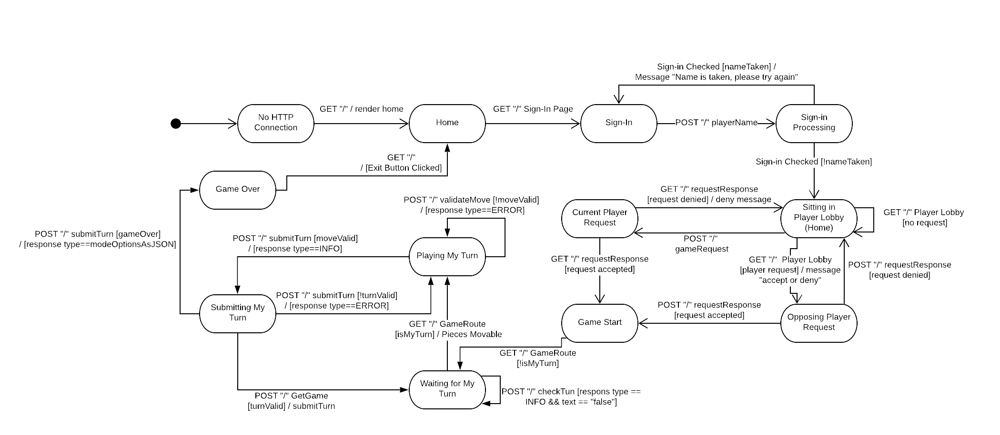
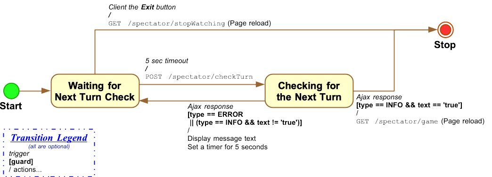
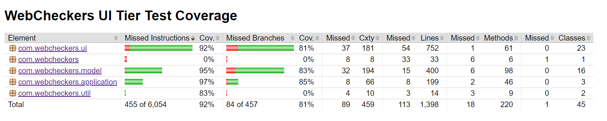
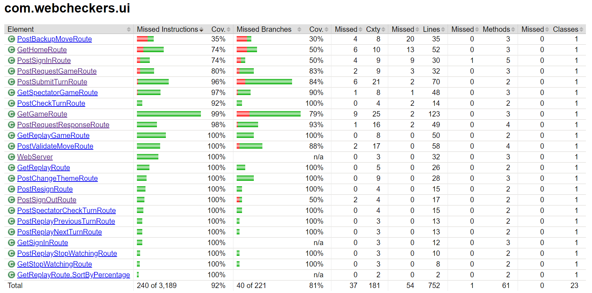

# PROJECT Design Documentation

> _The following template provides the headings for your Design
> Documentation.  As you edit each section make sure you remove these
> commentary 'blockquotes'; the lines that start with a > character
> and appear in the generated PDF in italics._

## Team Information
* Team name: SWEN FWIENDS
* Team members
  * Austin Miller
  * Mikayla Wishart
  * Amena Baig
  * Sean Bergen
  * Mario Castano

## Executive Summary

This is a summary of the project.

### Purpose

To create a high quality WebCheckers product following the American Rules of
 Checkers in a web application to delight Gary and Ivana. We were able to 
 create a few different enhancements for the WebCheckers application including
 Spectator Mode, Replay Mode and a change of theme to ducks.

### Glossary and Acronyms
> _Provide a table of terms and acronyms._

| Term | Definition |
|------|------------|
| VO | Value Object |
| MVP | Minimum Viable Product |
| UI | User Interface|
| CSS| Cascading Style Sheets |
| FTL | Freemarker Template |

## Requirements

The webcheckers app follows the American rules of checkers. The main components
 for the Webcheckers implementation is the ability to sign-in as a player
 , start a game, and make a valid move. (For now).

### Definition of MVP

The MVP is producing an application that implements the American rules of
 webcheckers. It allows players to sign-in and challenge each other to a game.

### MVP Features

Sign-in, Start game, Make a Move (Big stories of Move and Jump as well), End the
 Game, and Sign-out. 

### Roadmap of Enhancements
> _Provide a list of top-level features in the order you plan to consider them._

Sign-in, Make a Move (move, jump, then king), Sign-out and End the Game.

## Application Domain

This section describes the application domain.

> _Provide a high-level overview of the domain for this application. You
> can discuss the more important domain entities and their relationship
> to each other._

The domain of this application is a basic overview of the checkers game. A
 checkers game is played on a board comprised of row. Each row is comprised
  of spaces. Each space is either white or black. Each space can be occupied
   by a piece, the piece can be kinged (allowing it to move differently) or a
    single piece. (It also can be red or black depending on which player owns
     it)
     
The board is viewed from a player via a BoardView. The player does move
 pieces though from spaces. Each space has a position that, when a move is
  made, determines where a piece is moved to. The move holds two positions
   and changes the location of a piece from one to another if possible. It is
    either moved via a jump or a regular move.  

## Architecture and Design

This section describes the application architecture.

### Summary

The following Tiers/Layers model shows a high-level view of the webapp's architecture.

As a web application, the user interacts with the system using a
browser.  The client-side of the UI is composed of HTML pages with
some minimal CSS for styling the page.  There is also some JavaScript
that has been provided to the team by the architect.

The server-side tiers include the UI Tier that is composed of UI Controllers and Views.
Controllers are built using the Spark framework and View are built using the FreeMarker framework.  The Application and Model tiers are built using plain-old Java objects (POJOs).

Details of the components within these tiers are supplied below.

### Overview of User Interface

This section describes the web interface flow; this is how the user views and interacts
with the WebCheckers application.

The statechart above describes how the game is processed. We used several
 smaller statecharts to define smaller essential components that are useful
  during web-checkers, including the 2 (and a half) enhancements that we
   included during the web-checkers latest release. 
     
The client can generate 4 different pages of content, which are generated
 using a Freemarker template to update dynamically. The Home Page is seen
  when a user first requests to visit the webpage, all other requests
   redirect here if a player cannot be found in the session. Here a generated
    *theme* is erased unless the session is found as well. The Home Page
     displays how many users are logged in and how many games are currently
      active. Using the navigation bar they can select to sign-in.
      
This generates a sign-in page, it determines whether a username inputted by
 the user is valid, then will generate a Player Object and place them inside
  the server's lobby. Then it will redirect the player home.
  
The player now sees a different home page, one where they can request to play
 against another logged in player, or watch an active game. Additionally
 , there is the ability to view all completed games by accessing a "replay
  archive". In the nav-bar there is now the ability to redirect home, switch
   the theme, or sign-out. Switching the theme updates the style.css (and
    game.css) to use a different color and turns the page pink. Pressing it
     again clears the change.
     
If the player chooses to watch a game or requests to play against another
 player (who accepts) then they are redirected to the game page, which is
  generated using the `game.ftl`. Here the active player has their pieces
   located on the bottom of the page. And during a game there are 2 main
    states.
    

There are states located inside the .ftl and javascript files
 for the client. When it's a player's turn they enter an empty state. They
  make moves and submit it for move validation. From their they can either
   submit to confirm that their turn was valid or go back to a previous move
   . Additionally, the user can view the number of spectators who are
    currently watching the game.
   

When it is not their turn, they are merely waiting for it. They have the
 option to resign, (if they grow tired of waiting) or the webpage will update
  ever 5 seconds until it is their turn again or the game ends.
  
If the player chooses to sign-out during an ongoing match, they will resign
 the game.
 

 
If a user, when on the home screen, chooses to watch another player then they
 are directed to the game page again, but the view mode is now in *SPECTATOR*.
  The page is updated every 5 seconds waiting for a turn to be updated.
  
Another possibility is for the user to enter a replay archive from the home
 screen. By entering the archive all games that have been played before are
  displayed. Selecting a game again loads the game page with the view mode as
   *REPLAY*. Here the user can change the turn by either clicking next, or
    previous. The buttons are grayed out when the user is at the first last
     and first turn, respectively.
  
 

### UI Tier

The UI Tier of the program handles client side requests to the server
, routing them to wherever is necessary and returning a response to the user
. When a user connects to the WebServer they issue a `GET` command for the
 home page or home route. (If they issue any other `GET` or `POST` by
  accident they are redirected here if they are not signed in.) The user then
   has an option to `GET /signIn` which redirects them to a sign-in page.
   
The sign-in page will issue a `POST` when the user has entered a username to
 a `POST /signIn` which the server will validate by accessing different tiers
  of architecture. If valid it will reidrect back to the homepage.
  
Here there are three major features and one minor feature to the tier.

#####Starting and Playing a Game

* One user must submit a `POST /requestGame` route to another player.
* The user must accept using a `POST /requestResponse`.
* If accepted both players are redirect to the game page which issues a `GET
 /game` request.
 * If it is the players turn they can make a move using a `POST /validateMove
 `, but their move has not yet been submitted to the server. If the move is
  invalid the move is rejected. 
* They can back-up to the last valid move that was made using a `POST
  /backupMove`
 * They can submit their turn which is confirmed server side using a `POST
  /submitTurn` route.
 * If it is not the users turn then every 5 seconds a `POST /checkTurn
 ` request is made to determine if the game should update the active game or
  not.
  * At anytime either player can end the game by resigning using the `POST
   /resign` route. 
 
#####Watching an Active Game

* The active games are displayed in the designated section, clicking on the
 'Watch Game' button issues a `GET /spectator/game` with the name of the red
  user as the parameters.
* Every 5 seconds a `POST /spectator/checkTurn` is issued to see if a new
 turn was made or not.
 * The user can stop watching by issuing a `POST /spectator/stopWatching`

#####Replaying an Already Played Game

* The replay vault is accessed using a `GET /replay` route. Which generates a
 replay page with all games played sorted by average winning percentage for
  the players.
* A game is accessed using a `GET /replay/game`.
* The user watching can change with turn they are on by issuing a `POST
 /replay/nextTurn` or a `POST /replay/previousTurn`.
 * The user can stop watching the game and be redirected to the home page
  with a `POST /replay/stopWatching`.

#####Changing the Theme
* A user can change the theme of the webpage by clicking the swich-theme
 button in the navbar. This issues a `POST /changeTheme` request. This
  updates the servers theme in the session and the generated .css files.

### Application Tier
The Application Tier is responsible for the logic that flows through the application.
The only class that is currently in our Application Tier is the `PlayerLobby` class 
which has a single responsibility of keeping track of all the `Player`'s that are 
currently running the application. The `PlayerLobby` has the responsibility to keep 
track of who is currently in a game, who is currently in a game request and who is waiting 
to get/send a game request.

### Model Tier
The Model tier is responsible for managing the domain entities and domain logic.
There are currently nine classes in the Model tier: Board, BoardView, CheckerGame, 
Move, Piece, Player, Position, Row, and Space. These classes work together in order 
to process user actions, effect changes to the model based on the user actions, and 
maintain the state of the model. Each class represents an entity in the model (ex: 
Piece represents a checker piece and its attributes describe if its a black/white
piece, or a single/king).

In the Domain Model diagram outlined earlier in this design document, it can be seen
that the CheckerGame class encompasses the state of the board. The board is comprised 
of numerous Rows, which are ArrayLists of Spaces. Spaces can be Black or White, but 
only Black spaces can contain Pieces. Pieces are red for the first player (or the one 
who challenges the other player), and white for the second player. This entire Board 
is conveyed to Player using the BoardView. We made the decision to have a separate 
BoardView class because the board has to be flipped depending on which player is 
viewing it and this seemed to be the most simplest and effective means to do so.
The Player makes changes to the overall CheckerGame by making Moves, which can be 
regular moves (where the piece is moved one diagonal space) or jump moves (where the 
piece jumps diagonally over an opponent's piece in order to collect it). When the 
player makes a Move, the program tries to validate the movement of the start Position 
to the End position. These Moves, after they are Validated, alter the Position in 
which a Piece is placed on the Board. Although Space does have its row and column 
fields, we made the design decision of creating a separate Position class as a simple 
way to refer to the location of a Space on the Board when making a Move.

### Design Improvements
If development were to continue on this product, there are a few areas
in which our design could be further improved.  Some methods that were
written could have likely been made more efficient, and the same could
be said for some of the objects that were written.  In particular,
more could be done to have higher cohesion and better seperation of
responsibilities, especially within the routes that were defined, as
well as within the piece, space, and row classes.

Reviewing the code metrics,

## Testing
> _This section will provide information about the testing performed
> and the results of the testing._

### Acceptance Testing
> _Report on the number of user stories that have passed all their
> acceptance criteria tests, the number that have some acceptance
> criteria tests failing, and the number of user stories that
> have not had any testing yet. Highlight the issues found during
> acceptance testing and if there are any concerns._

So far three stories have passed all unit testing. These stories are the
 Player sign-in, Start a Game, and Username Checking. The issues found in
  testing were primarily dealing with analogous responses during requestGame
   and with usernames starting with a number. Following an implementation of
    unit testing these issues were found and taken care of. 

### Unit Testing and Code Coverage
> _Discuss your unit testing strategy. Report on the code coverage
> achieved from unit testing of the code base. Discuss the team's
> coverage targets, why you selected those values, and how well your
> code coverage met your targets. If there are any anomalies, discuss
> those._

The strategy for unit testing was to find the most complete (or what we
 thought were complete) classes and begin testing with those. However
 , originally we struggled finding the correct area to test because unit
  testing only acquires so much. Until we exported boards as JSON objects and
   allowed them to be used in Unit Testing.

The strategy that we used for unit testing was we found the largest classes
and the largest methods within those classes and started there when creating
unit testing. As we continued on and the code coverage started increasing, we
started to tackle the smaller classes. The overall code coverage that we managed
to achieve was a 90% which reached our ultimate goal, however the UI tier
was not able to get to the 90% that we had hoped for each tier to achieve.

As you can see, the UI tier did not quite meet the goal of 90% code coverage 
that we were hoping to achieve. The model tier and application tier went well 
beyond this goal. This was due to a lack of communication and commitment from
some team members. It was also partially due to the fact that as classes
were finished, team members were not writing the unit tests that needed to be
made and writing them the last night became fairly difficult. Although we 
had quite a bit of tests to write the last night before the final release, 
we were able to get up to 87% code coverage on the UI tier.

We also were unable to create the code coverage for parts of the enhancements 
given the time restriction that we had, we were able to get as much done as we
could.