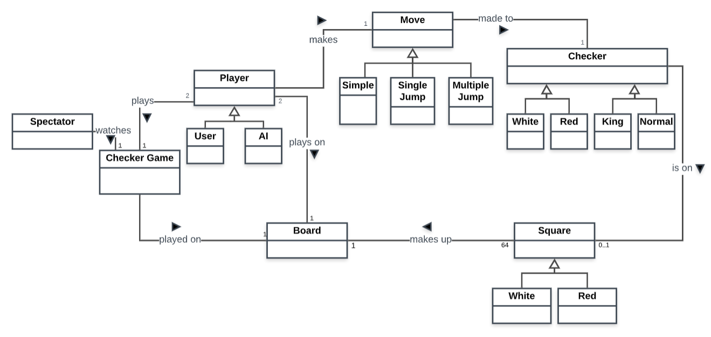

# PROJECT Design Documentation

> _The following template provides the headings for your Design
> Documentation.  As you edit each section make sure you remove these
> commentary 'blockquotes'; the lines that start with a > character
> and appear in the generated PDF in italics._

## Team Information
* Team name: SWEN FWIENDS
* Team members
  * Austin Miller
  * Mikayla Wishart
  * Amena Baig
  * Sean Bergen
  * Mario Castano

## Executive Summary

This is a summary of the project.

### Purpose
> _Provide a very brief statement about the project and the most
> important user group and user goals._

### Glossary and Acronyms
> _Provide a table of terms and acronyms._

| Term | Definition |
|------|------------|
| VO | Value Object |

## Requirements

This section describes the features of the application.

The webcheckers app follows the American rules of checkers. The main components
 for the Webcheckers implementation is the ability to sign-in as a player
 , start a game, and make a valid move. (For now).

### Definition of MVP

>
The MVP is producing an application that implements the American rules of
 webcheckers. It allows players to sign-in and challenge each other to a game.

### MVP Features

Sign-in, Start game, Make a Move (Big stories of King and Jump as well), End the
 Game, and Sign-out. 

### Roadmap of Enhancements
> _Provide a list of top-level features in the order you plan to consider them._

Sign-in, Make a Move (jump, then king), Sign-out and End the Game.

## Application Domain

This section describes the application domain.

> _Provide a high-level overview of the domain for this application. You
> can discuss the more important domain entities and their relationship
> to each other._

The domain of this application is a basic overview of the checkers game. A
 checkers game is played on a board comprised of squares. Each square is
  either white or red. The checkers are placed on the board, either white or
   red, and either "kinged" or regular. The pieces move around the board by
    either going to a valid space or jumping an opponent's piece as many
     times as possible. A player plays the game of checkers.

## Architecture and Design

This section describes the application architecture.

### Summary

The following Tiers/Layers model shows a high-level view of the webapp's architecture.

As a web application, the user interacts with the system using a
browser.  The client-side of the UI is composed of HTML pages with
some minimal CSS for styling the page.  There is also some JavaScript
that has been provided to the team by the architect.

The server-side tiers include the UI Tier that is composed of UI Controllers and Views.
Controllers are built using the Spark framework and View are built using the FreeMarker framework.  The Application and Model tiers are built using plain-old Java objects (POJOs).

Details of the components within these tiers are supplied below.

### Overview of User Interface

This section describes the web interface flow; this is how the user views and interacts
with the WebCheckers application.

![[The WebCheckers Web Interface Statechart]](web-checkers-statechart.png)

The User interface relies on 3 main pages. The Home page, which updates based
 on a player actively being signed in or not, the sign-in page, and the game
  page. The home page displays a sign-in prompt if the player is not
   currently stored in the http-session and the server understands that.

### UI Tier

The UI Tier deals with the requests dealt from the server. The server is the 
system running the WebServer class. The user navigates to the address and a 
`GET /home`. The only true option is to `GET /signin`. This HTTP request 
sends to a new FTL page with a sign-in option. Once a username is type it is 
submitted via a `POST /signin` route which is validated in different package.

 If validated this Player attribute is held in the httpSession and the user 
 is redirected back to the Home screen. Here there are options to request a 
 game, which is handled through a `POST /requestgame`. There is no page so 
 the server takes the challenged player and updates their screen using the 
 `GET /home`. They answer with a `POST /requestresponse`.
 
 Finally there is a navigation to the `GET /game` which is handled through 
 it's ftl imported from a model.

### Application Tier
The Application Tier is responsible for the logic that flows through the application.
The only class that is currently in our Application Tier is the `PlayerLobby` class 
which has a single responsibility of keeping track of all the `Player`'s that are 
currently running the application. The `PlayerLobby` has the responsibility to keep 
track of who is currently in a game, who is currently in a game request and who is waiting 
to get/send a game request.

### Model Tier
> _Provide a summary of the Application tier of your architecture. This
> section will follow the same instructions that are given for the UI
> Tier above._

### Design Improvements
If development were to continue on this product, there are a few areas
in which our design could be further improved.  Some methods that were
written could have likely been made more efficient, and the same could
be said for some of the objects that were written.  In particular,
more could be done to have higher cohesion and better seperation of
responsibilities, especially within the routes that were defined, as
well as within the piece, space, and row classes.

Reviewing the code metrics,

## Testing
> _This section will provide information about the testing performed
> and the results of the testing._

### Acceptance Testing
> _Report on the number of user stories that have passed all their
> acceptance criteria tests, the number that have some acceptance
> criteria tests failing, and the number of user stories that
> have not had any testing yet. Highlight the issues found during
> acceptance testing and if there are any concerns._

### Unit Testing and Code Coverage
> _Discuss your unit testing strategy. Report on the code coverage
> achieved from unit testing of the code base. Discuss the team's
> coverage targets, why you selected those values, and how well your
> code coverage met your targets. If there are any anomalies, discuss
> those._
