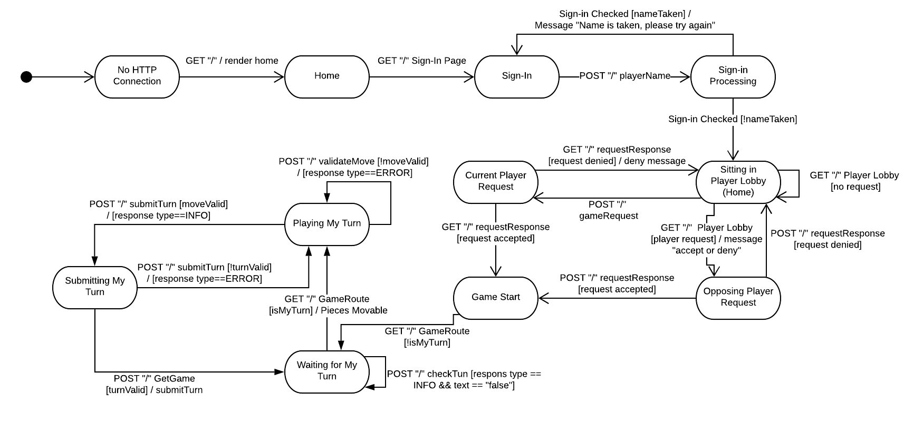
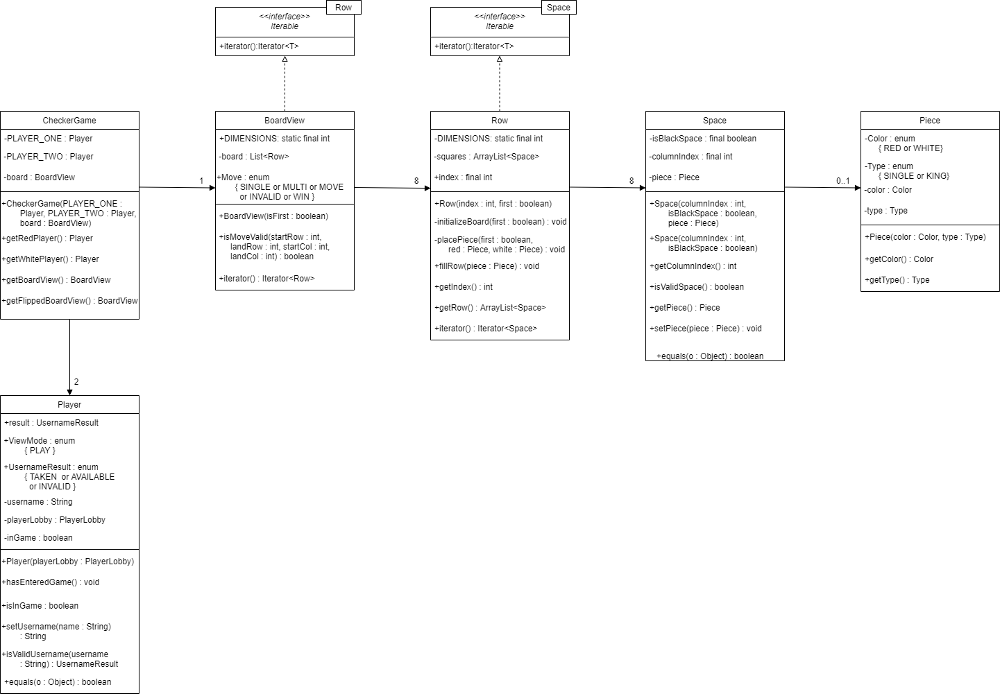
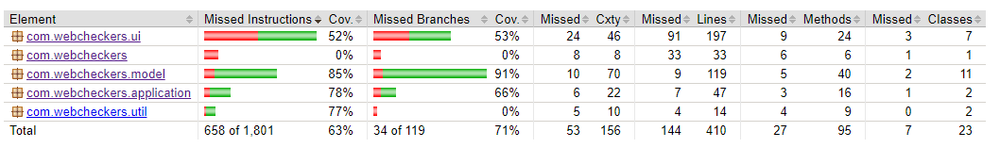

# PROJECT Design Documentation

> _The following template provides the headings for your Design
> Documentation.  As you edit each section make sure you remove these
> commentary 'blockquotes'; the lines that start with a > character
> and appear in the generated PDF in italics._

## Team Information
* Team name: SWEN FWIENDS
* Team members
  * Austin Miller
  * Mikayla Wishart
  * Amena Baig
  * Sean Bergen
  * Mario Castano

## Executive Summary

This is a summary of the project.

### Purpose
> _Provide a very brief statement about the project and the most
> important user group and user goals._

### Glossary and Acronyms
> _Provide a table of terms and acronyms._

| Term | Definition |
|------|------------|
| VO | Value Object |

## Requirements

This section describes the features of the application.

The webcheckers app follows the American rules of checkers. The main components
 for the Webcheckers implementation is the ability to sign-in as a player
 , start a game, and make a valid move. (For now).

### Definition of MVP

>
The MVP is producing an application that implements the American rules of
 webcheckers. It allows players to sign-in and challenge each other to a game.

### MVP Features

Sign-in, Start game, Make a Move (Big stories of Move and Jump as well), End the
 Game, and Sign-out. 

### Roadmap of Enhancements
> _Provide a list of top-level features in the order you plan to consider them._

Sign-in, Make a Move (jump, then king), Sign-out and End the Game.

## Application Domain

This section describes the application domain.

> _Provide a high-level overview of the domain for this application. You
> can discuss the more important domain entities and their relationship
> to each other._

The domain of this application is a basic overview of the checkers game. A
 checkers game is played on a board comprised of row. Each row is comprised
  of spaces. Each space is either white or black. Each space can be occupied
   by a piece, the piece can be kinged (allowing it to move differently) or a
    single piece. (It also can be red or black depending on which player owns
     it)
     
The board is viewed from a player via a BoardView. The player does move
 pieces though from spaces. Each space has a position that, when a move is
  made, determines where a piece is moved to. The move holds two positions
   and changes the location of a piece from one to another if possible. It is
    either moved via a jump or a regular move.  

## Architecture and Design

This section describes the application architecture.

### Summary

The following Tiers/Layers model shows a high-level view of the webapp's architecture.

As a web application, the user interacts with the system using a
browser.  The client-side of the UI is composed of HTML pages with
some minimal CSS for styling the page.  There is also some JavaScript
that has been provided to the team by the architect.

The server-side tiers include the UI Tier that is composed of UI Controllers and Views.
Controllers are built using the Spark framework and View are built using the FreeMarker framework.  The Application and Model tiers are built using plain-old Java objects (POJOs).

Details of the components within these tiers are supplied below.

### Overview of User Interface

This section describes the web interface flow; this is how the user views and interacts
with the WebCheckers application.

The statechart above describes how the game is processed. There are two minor
 state charts that are included below that represent states that were
  provided via the initial architecture, and not something produced by this
   group.

The User interface relies on 3 main pages. The Home page, which updates based
 on a player actively being signed in or not, the sign-in page, and the game
  page. The home page displays a sign-in prompt if the player is not
   currently stored in the http-session. From there the player can login by
    submitting a post request to sign-in. This is processed and determines if
     the player can be added to the lobby.

Once in the lobby they can request to start a game with other players. They
 either receive or send a request. Depending on how the players respond it
  either starts a game or resets the home screen where the player is simply
   sitting in the lobby.
   
Then the game starts, during the start of the game there are 3 main states
. Since these weren't produced by the group below is each provided statechart.

There are states located inside the .ftl and javascript files
 for the client. When it's a player's turn they enter an empty state. They
  make moves and submit it for move validation. From their they can either
   submit to confirm that their turn was valid or go back to a previous move.
   

When waiting for a turn the main thing that happens is a `POST /checkTurn
` submitted to the server to determine the turn status has been updated.

### UI Tier

The UI Tier deals with the requests dealt from the server. The server is the 
system running the WebServer class. The user navigates to the address and a 
`GET /home`. The only true option is to `GET /signin`. This HTTP request 
sends to a new FTL page with a sign-in option. Once a username is type it is 
submitted via a `POST /signin` route which is validated in different package.

 If validated this Player attribute is held in the httpSession and the user 
 is redirected back to the Home screen. Here there are options to request a 
 game, which is handled through a `POST /requestgame`. There is no page so 
 the server takes the challenged player and updates their screen using the 
 `GET /home`. They answer with a `POST /requestresponse`.
 
 Finally there is a navigation to the `GET /game` which is handled through 
 it's ftl imported from a model.

### Application Tier
The Application Tier is responsible for the logic that flows through the application.
The only class that is currently in our Application Tier is the `PlayerLobby` class 
which has a single responsibility of keeping track of all the `Player`'s that are 
currently running the application. The `PlayerLobby` has the responsibility to keep 
track of who is currently in a game, who is currently in a game request and who is waiting 
to get/send a game request.

### Model Tier
The Model tier is responsible for managing the domain entities and domain logic.
There are currently six classes in the Model tier: BoardView, CheckerGame, Piece,
Player, Row, and Space. These classes work together in order to process user actions,
effect changes to the model based on the user actions, and maintain the state of the
model. Each class represents an entity in the model (ex: Piece represents a checker
piece and its attributes describe if its a black/white piece, or a single/king).

In the Model tier pictured above, there is a CheckerGame which serves as the wrapper 
class for the model; in other words, it encompasses all aspects of the model. It contains 
the two Players for the games as well as the board, represented by BoardView. BoardView 
holds a List of 8 Rows. Each Row contains an ArrayList of 8 Spaces. The Spaces alternate
in color depending on their index in the Row. A black Space may contain a Piece. A
Piece could be either Red or White, and a Single or King. 

### Design Improvements
If development were to continue on this product, there are a few areas
in which our design could be further improved.  Some methods that were
written could have likely been made more efficient, and the same could
be said for some of the objects that were written.  In particular,
more could be done to have higher cohesion and better seperation of
responsibilities, especially within the routes that were defined, as
well as within the piece, space, and row classes.

Reviewing the code metrics,

## Testing
> _This section will provide information about the testing performed
> and the results of the testing._

### Acceptance Testing
> _Report on the number of user stories that have passed all their
> acceptance criteria tests, the number that have some acceptance
> criteria tests failing, and the number of user stories that
> have not had any testing yet. Highlight the issues found during
> acceptance testing and if there are any concerns._

So far three stories have passed all unit testing. These stories are the
 Player sign-in, Start a Game, and Username Checking. The issues found in
  testing were primarily dealing with analogous responses during requestGame
   and with usernames starting with a number. Following an implementation of
    unit testing these issues were found and taken care of. 

### Unit Testing and Code Coverage
> _Discuss your unit testing strategy. Report on the code coverage
> achieved from unit testing of the code base. Discuss the team's
> coverage targets, why you selected those values, and how well your
> code coverage met your targets. If there are any anomalies, discuss
> those._

The strategy for unit testing was to find the most complete (or what we
 thought were complete) classes and begin testing with those. The most
  thorough we wanted were the PlayerLobby and Player. Since the most
   important part of Sprint 1 was dealing with the Players and signing-in
   . Then we used other parts that we found essential. The coverage goals
    were 80% throughout. For some (such as the UI-tier) it was difficult to
     truly meet this goal since using mockito only gives us so much. The
      actual tests have to be done in a demo style test.

As you can see the UI did not meet that goal. However, the application and
 model did. (Application has a Jacoco calculation error, when the link is
  clicked it actually shows 88%). This is because the GetGameRoute and
   GetSignInRoute remain untested.